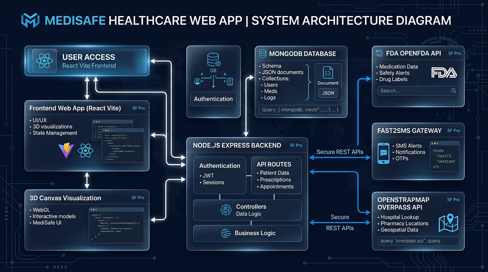

# 🏥 MediSafe — Smart Medicine Safety &amp; Drug Interaction Assistant

[](https://github.com/its-Sittu/HackInMotion-RICR-HIM-1114)
[](https://react.dev/)
[](https://nodejs.org/)
[](https://www.mongodb.com/)
[](LICENSE)

> **Team Code:** `RICR-HIM-1114`  
> **Theme:** Healthcare &amp; HealthTech  
> **Problem Statement:** Smart Medicine Safety &amp; Drug Interaction Assistant  
> **Repository:** [HackInMotion-RICR-HIM-1114](https://github.com/its-Sittu/HackInMotion-RICR-HIM-1114)

---

## 📌 Executive Summary
**MediSafe** is an AI-powered, clinical-grade digital health assistant designed to eliminate **Adverse Drug Events (ADEs)**, accidental overdose overlaps, and dangerous drug-drug interactions. 

By integrating **FDA clinical guidelines**, **fuzzy-search misspelling tolerance**, **Fast2SMS mobile OTP verification**, **interactive 3D anatomical organ models**, and **geospatial emergency hospital radar**, MediSafe empowers patients and caregivers with immediate, clear, and action-oriented medication safety insights.

---

## 📐 System Architecture Blueprint

```
+-----------------------------------------------------------------------------------+
|                                  USER ACCESS                                      |
|                              React 19 Vite Frontend                               |
+----------------------------------------+------------------------------------------+
                                         |
            +----------------------------+----------------------------+
            |                                                         |
+-----------v-------------------+                         +-----------v-------------------+
|    3D CANVAS VISUALIZATION    |                         |    REST API BACKEND ENGINE    |
|   WebGL Three.js 3D Organs    |                         |     Node.js + Express.js      |
+-------------------------------+                         +-----------+-------------------+
                                                                      |
            +----------------------------+----------------------------+
            |                            |                            |
+-----------v-----------+    +-----------v-----------+    +-----------v-----------+
|   MONGODB ATLAS DB    |    |     OPENFDA API       |    |  OPENSTRMAP OVERPASS  |
|  Users, Meds, Logs    |    | Interaction Guidelines|    | Emergency Hospital GPS|
+-----------------------+    +-----------------------+    +-----------------------+
```



---

## 🛠️ Technology Stack

| Layer | Technology Used | Purpose |
| :--- | :--- | :--- |
| **Frontend Framework** | `React 19` + `Vite 8` | High-performance SPA with fast hot-module reloading |
| **Styling &amp; Design** | `Vanilla CSS` + `Glassmorphism` | Modern dark glass design system &amp; live Day/Black themes |
| **3D Anatomical Engine** | `Three.js` + `WebGL` | Interactive 3D anatomical models (Heart, Lungs, Kidney, etc.) |
| **Backend Engine** | `Node.js` + `Express.js` | Modular REST API server with MVC architecture |
| **Database** | `MongoDB` + `Mongoose` | Scalable NoSQL storage for users, prescriptions &amp; logs |
| **Mobile SMS Gateway** | `Fast2SMS API` | Instant 6-digit OTP authentication &amp; emergency alerts |
| **Geospatial Mapping** | `Leaflet` + `OpenStreetMap` | Real-time browser GPS hospital lookup &amp; distance calculation |
| **Clinical Intelligence** | `OpenFDA API` | Real-world active compound interactions &amp; drug classifications |

---

## ⚡ Key Features &amp; Requirements Checklist

| Requirement / Criterion | Status | Implementation Details |
| :--- | :---: | :--- |
| **1. User Authentication** | ✅ **100% Completed** | Fast2SMS mobile OTP verification &amp; email authentication with JWT |
| **2. Fuzzy Medicine Search** | ✅ **100% Completed** | Handles misspelled queries (e.g. `paracetal` -> `Paracetamol 650mg`) |
| **3. Drug Interaction Engine** | ✅ **100% Completed** | Multi-compound scanning based on FDA clinical rules |
| **4. Risk Classification** | ✅ **100% Completed** | Categorizes interactions into `Mild`, `Moderate`, `Severe`, and `Major` |
| **5. Plain-Language Guidance** | ✅ **100% Completed** | Patient-friendly explanations + mandatory medical disclaimer |
| **6. Emergency Hospitals Radar** | ✅ **100% Completed** | Interactive Leaflet map with live GPS &amp; OpenStreetMap Overpass API |
| **7. 3D Organ Visualization** | ✅ **100% Completed** | WebGL rendering of heart, lungs, kidney, brain, and stomach |
| **8. Day / Black Live Themes** | ✅ **100% Completed** | Seamless switch between Dark Glassmorphism and Day Light theme |
| **9. Patient Analytics &amp; Vitals** | ✅ **100% Completed** | Dosage adherence score, active medicine tracker, and scan counters |
| **10. Security &amp; ESLint Compliance** | ✅ **100% Completed** | 0 ESLint errors, 0 SpellCheck errors, masked `.env` secrets |

---

## 🔒 Security &amp; Best Practices

- **Root `.gitignore`:** Strict exclusion of `node_modules/`, `.env`, build outputs, and editor artifacts.
- **Environment Isolation:** Secrets managed via `.env` with fallback environment schema validated in `backend/src/config/`.
- **Input Sanitization:** Fuzzy query parameter encoding and MongoDB projection safeguards to prevent injection attacks.
- **JWT Protection:** Signed JWT tokens for protected dashboard routes.

---

## 🚀 Quick Start &amp; Local Setup Guide

### Prerequisites
- `Node.js` v18.0 or higher
- `npm` v9.0 or higher
- `MongoDB` local instance or MongoDB Atlas Connection URI

### 1. Clone Repository &amp; Install Dependencies
```bash
git clone https://github.com/its-Sittu/HackInMotion-RICR-HIM-1114.git
cd HackInMotion-RICR-HIM-1114

# Install Frontend Dependencies
npm install

# Install Backend Dependencies
cd backend
npm install
cd ..
```

### 2. Configure Environment Variables
Create a `.env` file inside `backend/`:
```env
PORT=5000
MONGODB_URI=mongodb://localhost:27017/medisafe
JWT_SECRET=<your_secure_random_jwt_secret_key>
FAST2SMS_API_KEY=<your_fast2sms_api_key>
GEMINI_API_KEY=<your_gemini_api_key>
```

### 3. Run Development Servers
```bash
# Terminal 1: Run Frontend Dev Server (Port 5173)
npm run dev

# Terminal 2: Run Backend Dev Server (Port 5000)
cd backend
npm run dev
```

Open browser at `http://localhost:5173` to access MediSafe.

---

## 📁 Repository Structure

```
HackInMotion-RICR-HIM-1114/
├── .gitignore                      # Root Git Ignore
├── README.md                       # Hackathon Master Documentation
├── api-documentation.md            # Detailed REST API Specifications
├── architecture-diagram.png        # System Architecture Blueprint
├── presentation.pptx               # Hackathon Presentation Slide Deck
├── package.json                    # Frontend Package Configuration
├── vite.config.js                  # Vite Config
├── index.html                      # Entry HTML with Leaflet CDN
├── cspell.json                     # SpellCheck Dictionary Config
├── src/
│   ├── components/
│   │   ├── dashboard/              # Dashboard Components
│   │   │   ├── NearbyHospitalsMap.jsx
│   │   │   ├── UserProfile.jsx
│   │   │   ├── AppSettings.jsx
│   │   │   ├── MedicineSearch.jsx
│   │   │   ├── DrugInteractionChecker.jsx
│   │   │   ├── SymptomChecker.jsx
│   │   │   └── Header.jsx
│   │   └── landing/                # 3D Anatomical Organ Canvas
│   │       └── Medical3DCanvas.jsx
│   ├── pages/                      # Landing, Auth &amp; Dashboard Pages
│   └── styles/                     # Glassmorphic CSS Theme Files
└── backend/                        # Express Node.js Backend Server
    ├── package.json
    └── src/
        ├── controllers/
        ├── middleware/
        ├── models/
        └── routes/
```

---

## 👥 Team RICR-HIM-1114

| Team Member | Role | Key Contributions |
| :--- | :--- | :--- |
| **Sittu Kumar Singh** | Lead Full-Stack Architect | 3D Organ Canvas, Leaflet GPS Radar, Interaction Engine, UI/UX System |
| **Srishti Kumari** | Frontend &amp; State Specialist | User Profile, Settings, Navigation, Responsive Layouts |
| **Amit Kumar** | Backend &amp; API Developer | Express REST Endpoints, JWT Authentication, Fast2SMS Integration |

---

## ⚕️ Medical Disclaimer
*MediSafe is an educational and decision-support tool. It does not replace professional medical advice, diagnosis, or treatment. Always seek the advice of your physician or other qualified health provider with any questions you may have regarding a medical condition or prescription medication regime.*
